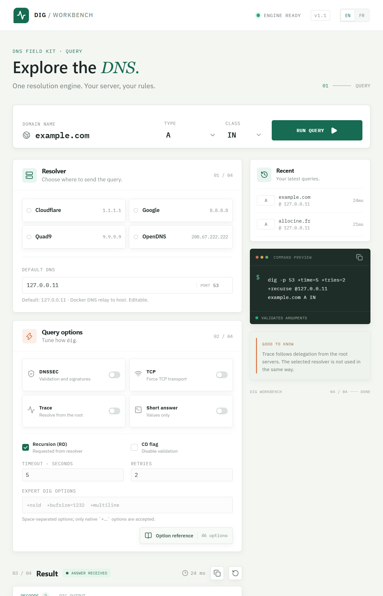
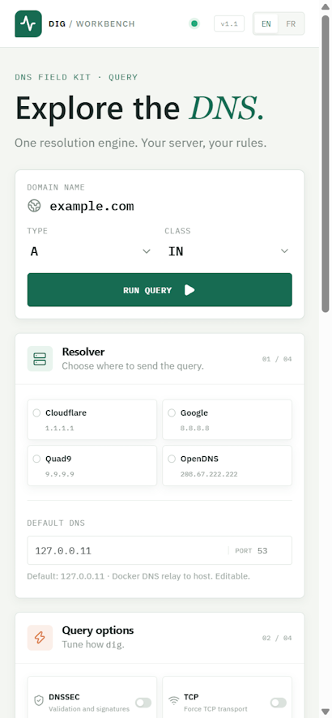

# Dig Workbench

<p align="center">
	
	
</p>

A bilingual web workbench for querying DNS with the real `dig` binary. Choose a resolver, configure the query, and inspect parsed records or the complete `dig` output.

## Run with Docker

Start Docker Desktop with Linux containers enabled. From the project directory, run:

```powershell
docker compose up --build -d
```

Open [http://localhost:8080](http://localhost:8080). Stop the service with `docker compose down`.

The Compose service builds the frontend and backend together, installs `dnsutils` for `dig`, and runs the app as a non-root user with a read-only filesystem:

```yaml
services:
	dig-workbench:
		build: .
		image: dig-workbench:local
		container_name: dig-workbench
		environment:
			DEFAULT_DNS_SERVER: ${DEFAULT_DNS_SERVER:-}
		ports:
			- "8080:8080"
		restart: unless-stopped
		read_only: true
		tmpfs:
			- /tmp
		cap_drop:
			- ALL
		security_opt:
			- no-new-privileges:true
```

By default, the resolver is detected from the application's DNS environment. In Docker, it forwards DNS requests to the host's resolver. To set a different default, add this to a root-level `.env` file:

```env
DEFAULT_DNS_SERVER=192.168.1.1
```

This setting is optional and can still be changed in the interface.

## Local development

The Vite frontend proxies API requests to the Docker backend, so start the Compose service first:

```powershell
docker compose up --build -d
npm install
npm run dev
```

Vite prints the local URL when it starts. The Docker app remains available at `http://localhost:8080`.

## Query options

| Option | What it does |
| --- | --- |
| Resolver and port | Choose a popular resolver or enter an IPv4 address, IPv6 address, or hostname; set a DNS port from 1 to 65535. |
| Record type and class | Query common types and the IN, CH, HS, or ANY class, or enter a custom `TYPE####` value (0–65535). |
| DNSSEC | Request DNSSEC records and signatures with `+dnssec`; this does not itself validate signatures. |
| TCP | Force TCP transport with `+tcp`. |
| Trace | Follow delegation from the root servers with `+trace`. The selected resolver is not used in the usual way. |
| Short answer | Return concise values with `+short`. |
| Recursion (RD) | Request recursive resolution with `+recurse`, or disable it with `+norecurse`. |
| CD flag | Set `+cdflag` to ask the resolver not to reject an answer based on DNSSEC validation. |
| Timeout and retries | Set the per-attempt timeout (1–15 seconds) and retry count (1–5). |
| Expert options | Pass up to 24 space-separated native `dig` `+...` options, such as `+nsid` or `+bufsize=1232`. |

Supported record types include A, AAAA, CAA, CNAME, DNSKEY, DS, HTTPS, MX, NS, PTR, SOA, SRV, SSHFP, SVCB, TLSA, TXT, and ANY. Custom DNS type codes can be entered as `TYPE####`.

## Examples

These commands illustrate equivalent queries using `dig` directly. In the workbench, enter the name, type, resolver, and any desired options in their respective fields.

Query an IPv4 address record:

```sh
dig -p 53 +time=5 +tries=2 +recurse @1.1.1.1 example.com A IN
```

Request MX records with DNSSEC data:

```sh
dig @1.1.1.1 example.com MX +dnssec
```

Perform a reverse lookup for an IP address:

```sh
dig @1.1.1.1 -x 8.8.8.8
```

Show only the returned values:

```sh
dig @1.1.1.1 example.com A +short
```

## Security and data

The six most recent queries are stored in browser local storage. The backend accepts any resolver address and does not provide authentication; do not expose it to an untrusted network without adding access controls. Expert options are validated and passed to `dig` as separate arguments, never through a shell.

## Build and tests

```powershell
python -m venv .venv
.\.venv\Scripts\python.exe -m pip install -r backend/requirements.txt
npm run build
.\.venv\Scripts\python.exe -m unittest discover -s tests
```
